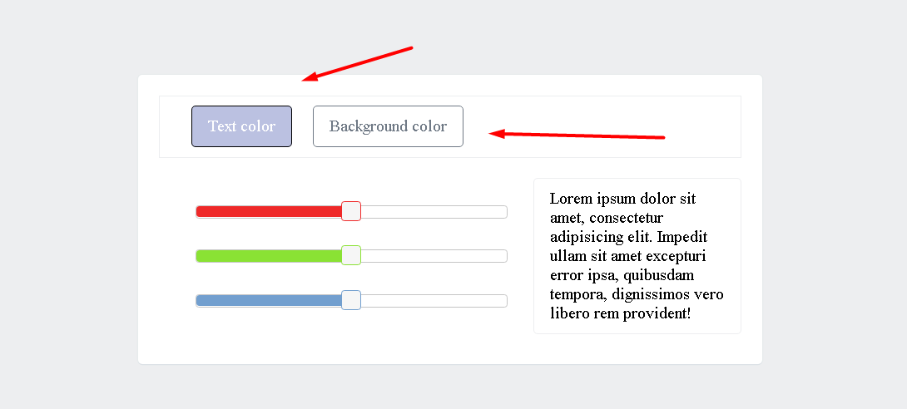
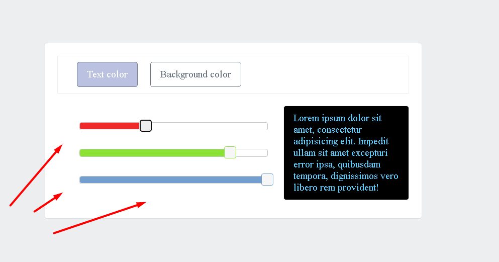

# ColorPicker-slider

## GH-PAGES LINK: https://yaroslavborshevsky812.github.io/colorPicker-slider/

## QUICK START

```
    npm i
    gulp watch style
```


## DESCRIPTION
1. Choose what you want to change 

2. Change it
